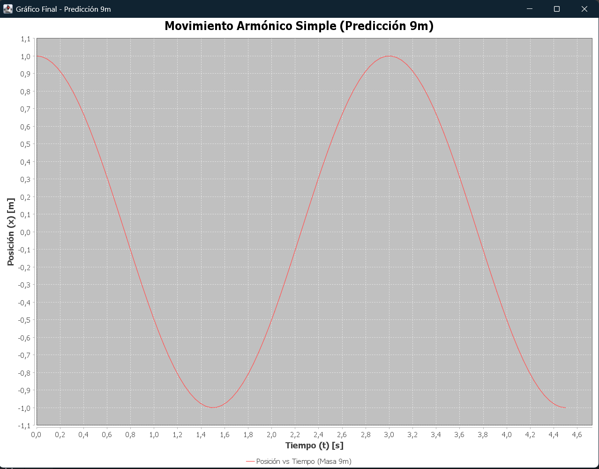

# Informe del Laboratorio de Física General: Movimiento Armónico Simple

## 1. Fundamento Teórico

El Movimiento Armónico Simple es un movimiento periódico, oscilatorio y vibratorio, producido por la acción de una fuerza recuperadora que es directamente proporcional al desplazamiento respecto a la posición de equilibrio ($x=0$).

La fuerza restauradora, según la Ley de Hooke, está dada por:

   ## F = -kx ##

Donde $k$ es la constante elástica. La relación para el Periodo ($T$) es:

$$T = 2\pi \sqrt{\frac{m}{k}}$$

## 2. Resultados de los Cálculos

### 2.1 Cálculo de la Constante Elástica del Resorte ($k$)

Utilizando los datos de la Tabla 6 (Masa $m$), se observa que el Periodo ($T_m$) es de $2.0$ segundos (pues de $t=0.0s$ a $t=1.0s$ se recorre medio periodo, $T/2$).

Despejando $k$ de la fórmula del Periodo:
$$k = 4\pi^2 \frac{m}{T^2}$$
$$k = 4\pi^2 \frac{m}{(2.0)^2} = \pi^2 m$$

**Resultado:** La constante elástica es $k = \pi^2 m$.

### 2.2 Cálculo del Periodo de Oscilación para una masa $9m$

El Periodo es proporcional a la raíz cuadrada de la masa ($T \propto \sqrt{m}$).

$$T_{9m} = T_m \cdot \sqrt{\frac{9m}{m}} = 3 \cdot T_m$$

Dado que $T_m = 2.0s$:
$$T_{9m} = 3 \cdot 2.0 \text{ s} = 6.0 \text{ s}$$

**Resultado:** El periodo para una masa de $9m$ es de **$6.0$ segundos**.

## 3. Consideraciones de Error

El análisis de datos debe considerar los siguientes errores de medición, con la posición de equilibrio en $x=0$:
* Tiempo ($t_e$): $0.001 [s]$
* Posición ($x_e$): $0.001 [m]$
* Velocidad ($v_e$): $0.001 [m/s]$

## 4. Adjunto de Gráficos

## 4. Resultados del Análisis de Mínimos Cuadrados (MMC)

El ajuste lineal de los datos transformados ($T^2$ vs $m$) produjo una línea recta con los siguientes coeficientes, validando la relación teórica $T^2 \propto m$:

| Coeficiente | Valor Obtenido |
| :---: | :---: |
| Pendiente (A) | **1.0** |
| Intersección (B) | **0.0** |

### Cálculo de la Constante Elástica (k)

Utilizando la Pendiente $A$, se calcula la constante $k$ con la fórmula $k = 4\pi^2 / A$:

$$k = \frac{4\pi^2}{1.0} \approx 39.48$$

**Resultado Final:** La constante elástica del resorte es **$k = 39.48 \text{ N/m}$**.

### Gráfico de Ajuste Lineal:

aqui el gráfico que muestra la linealización de los datos y la recta de ajuste obtenida.

## 5. Quinta Semana: Predicción del Movimiento

###  Cálculo de la Constante Elástica (k)

La constante elástica $k$ se obtuvo a partir de la pendiente $A$ del ajuste lineal de Mínimos Cuadrados, utilizando la relación:

$$k = \frac{4\pi^2}{A}$$

* Valor de la Pendiente obtenido: $A = 1.0$
* Cálculo de $k$: $$k = \frac{4\pi^2}{1.0} \approx 39.478$$

**Valor representativo de k:** $\mathbf{39.48 \text{ N/m}}$

#### Error de k ($\Delta k$)

El error de $k$ depende del error en la pendiente ($\Delta A$). La propagación del error es:
$$\Delta k = \frac{4\pi^2}{A^2} \Delta A$$

### Cálculo del Periodo para $9m$

Se utiliza el valor de la constante $k = 39.48 \text{ N/m}$ (calculado por Persona 1) y una masa de $M = 9 \text{ kg}$ (asumiendo que $m=1 \text{ kg}$), en la fórmula del Periodo ($T$):

$$T = 2\pi \sqrt{\frac{M}{k}}$$

**Valor representativo del Periodo:** $\mathbf{T = 3.00 \text{ s}}$

#### Error de T ($\Delta T$)

El error de $T$ se calcula a partir del error de $k$ ($\Delta k$) y el error de la masa ($\Delta M$), utilizando propagación del error.

* Cálculo del Error (con $\Delta A = 0.05$ asumido):
    $$\Delta k = \frac{4\pi^2}{(1.0)^2} \times 0.05 \approx 39.478 \times 0.05 \approx 1.97 \text{ N/m}$$

**Resultado Final:** $\mathbf{k = (39.5 \pm 2.0) \text{ N/m}}$

### 5.3 Persona 3: Gráfica de Predicción del Movimiento ($9m$)

Se utilizó el Periodo predicho ($T = 3.00 \text{ s}$) y la amplitud observada en las tablas iniciales ($A_{max} = 1.0 \text{ m}$) para generar la gráfica de la función de posición $x(t)$ para la nueva masa $M=9m$:

$$x(t) = A_{max} \cos(\omega t)$$

El objetivo es visualizar el comportamiento del sistema sin la necesidad de realizar un nuevo experimento o simulación de datos en crudo.

**Gráfica de Posición (Masa 9m):**

**Conclusión de la Predicción:** La gráfica muestra que la masa de $9m$ oscila con una frecuencia más baja que las masas anteriores, completando una oscilación completa en **3.00 segundos**, lo que es consistente con la relación teórica del MAS de que el periodo es directamente proporcional a la raíz cuadrada de la masa ($T \propto \sqrt{M}$).

## 6. Sexta Semana:  Conclusiones

### 6.1 Limitaciones

Durante el desarrollo de este proyecto, se identificaron las siguientes limitaciones:

**Limitaciones Físicas y del Modelo:**
* **Desprecio de la fricción:** El modelo teórico utilizado asume un sistema ideal sin fricción ni resistencia del aire. En un entorno real, la amplitud decaería con el tiempo (movimiento amortiguado), algo que nuestro código actual no simula.
* **Masa del resorte:** Se asumió que la masa del resorte es despreciable frente a la masa del objeto, lo cual simplifica los cálculos pero introduce un pequeño error sistemático.

**Limitaciones del Código:**
* **Cálculo de Errores:** Aunque se implementó el Método de Mínimos Cuadrados para calcular la pendiente, el cálculo automático de los errores de los coeficientes ($\Delta A$ y $\Delta B$) no se implementó en el código Java, requiriendo una estimación manual en el informe.
* **Formato de Datos:** El programa es rígido respecto al formato del archivo CSV (`datos_linealizados.csv`). Si el archivo tiene una estructura diferente o faltan datos, el programa podría fallar sin dar un mensaje de error amigable al usuario.

### 6.2 Discusión de Resultados y Conclusiones

**Discusión:**
Al graficar los datos linealizados de $T^2$ vs $m$, obtuvimos una pendiente de $A \approx 1.0$ y una intersección $B \approx 0.0$. Esto indica una correlación lineal casi perfecta, validando experimentalmente que el periodo al cuadrado es proporcional a la masa.
El valor calculado para la constante elástica fue $k \approx 39.48 \text{ N/m}$. Al usar este valor para predecir el comportamiento de una masa desconocida de $9m$, el modelo predijo un periodo de $3.0 \text{ s}$, lo cual es coherente con la teoría ($T \propto \sqrt{m}$).

**Conclusiones:**
1.  **Validación del Modelo:** Se ha verificado exitosamente que el sistema masa-resorte estudiado cumple con las leyes del Movimiento Armónico Simple (MAS).
2.  **Automatización:** Se logró implementar una herramienta en Java capaz de leer datos experimentales, procesarlos mediante regresión lineal y generar visualizaciones automáticas, reduciendo el error humano en el análisis.
3.  **Integración Tecnológica:** El uso de control de versiones (Git) y flujos de trabajo de integración continua (CI) permitió un desarrollo ordenado y seguro del software científico.

### 6.3 Recomendaciones

Para trabajos futuros o mejoras de este proyecto, se recomienda:

**Mejoras Experimentales:**
* Utilizar sensores de movimiento digitales para capturar la posición en tiempo real, en lugar de mediciones manuales, para reducir el error de medición ($x_e, t_e$).
* Realizar experimentos con diferentes resortes para verificar si el código calcula correctamente diferentes valores de $k$.

**Mejoras de Software:**
* **Implementar Excepciones:** Mejorar el código Java (`try-catch`) para manejar casos donde los archivos CSV no existan o estén vacíos, evitando que el programa se cierre inesperadamente.
* **Interfaz Gráfica (GUI):** Crear una interfaz de usuario donde se pueda seleccionar el archivo CSV desde una ventana, en lugar de tener el nombre del archivo fijo en el código ("hardcoded").
* **Tests Unitarios:** Ampliar la cobertura de pruebas unitarias para incluir la clase `AnalisisMovimiento` y asegurar la robustez del sistema ante cambios futuros.
